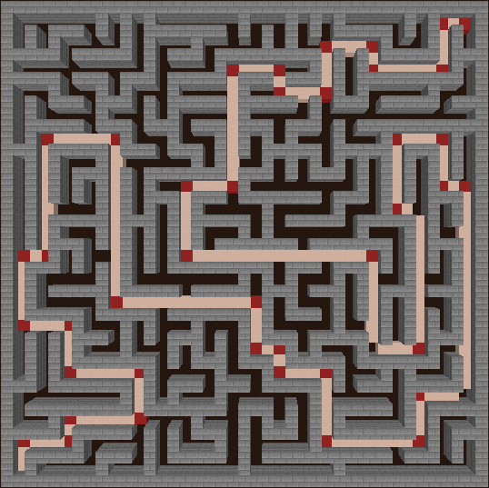

# pathwise

WIP pathfinding library for Bukkit plugins.

Thanks to Amit Patel and his unusual knack for explaining things clearly. My working A\* implementation is based heavily on [Introduction to A\*](https://www.redblobgames.com/pathfinding/a-star/introduction.html) and [Implementation of A\*](https://www.redblobgames.com/pathfinding/a-star/implementation.html).

## TODO

- [ ] Implement [Theta\*](https://arxiv.org/pdf/1401.3843) with a max distance
  - Unless I can find a good way to work with [Incremental Phi\*](http://www.cs.cmu.edu/~maxim/files/inctheta_ijcai09.pdf) scalably across an entire world
- [ ] Improve neighbor evaluation
  - [x] Fix corner cutting
  - [ ] No going straight up unless flag is set on some level that allows flying--require that block below target isn't passable
    - [x] Except ladders, vines, water from this rule
  - [ ] Figure out how to deal with block height and prevent pathfinding over fences etc.
  - [x] Prevent pathfinding through lava or over whatever other blocks hurt players (magma)
- [ ] Improve cost function
  - [x] Assign a high cost to falling
  - [ ] Assign a small cost for jumping up from one block to another, just because it's annoying
  - [ ] Avoid water
    - [ ] This cost could compound to account for running out of breath
    - [ ] For soul sand bubbles: lower cost when going up, raise cost when going down
  - [ ] Assign cost for any "slow" blocks like soul sand
- [ ] Look into adding a Y arc for paths where flying makes sense and is available
